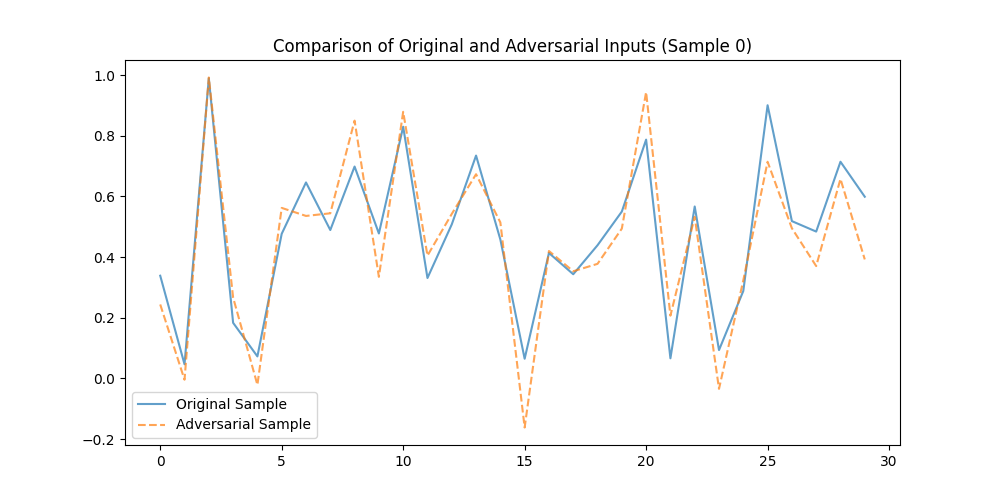

# 🎯 Adversarial-Attack-Simulation-on-Machine-Learning-Models
This project focusses on implementing fundamentals for developing and training machine learning models that respond to adversarial attacks. Specifically, it includes models to detect and evaluate the impact of general adversarial data, evasion attacks, and poisoning attacks.


---

## 📂 Project Structure
```plaintext
AI_Project/
│
├── data/                      # Folder to store datasets
│   └── creditcard.csv
├── adversarial_env/           # Your virtual environment (auto-generated)
├── dataset.py                 # For loading and preprocessing the dataset
├── train.py                   # For training the machine learning model
├── simulate.py                # For simulating adversarial attacks
├── analyze.py                 # For analyzing and visualizing results
├── mitigate.py                # For implementing mitigation strategies
├── utils.py                   # Any utility functions (e.g., common plots)
├── README.md                  # Documentation
└── main.py                    # The entry point to tie everything together
```

 # 🚀 Features

🧩 Dataset Handling: Preprocess the dataset and prepare it for training and evaluation.

🤖 Model Training: Train machine learning models with clean or adversarially augmented datasets.

🛡️ Adversarial Attacks:

Evasion attacks (e.g., FGSM, PGD).

Poisoning attacks to corrupt training data.

📊 Analysis & Visualization: Compare original and adversarial data, and evaluate model performance.

🛠️ Mitigation Strategies: Implement defenses to improve robustness against attacks.


# ⚡ Quick Start

## 1️⃣ Clone the Repository

$ git clone git@github.com:rianachatterjee04/Adversarial-Attack-Simulation-on-Machine-Learning-Models.git

$ cd Adversarial-Attack-Simulation-on-Machine-Learning-Models

## 2️⃣ Set Up the Environment

$ python3 -m venv adversarial_env

$ source adversarial_env/bin/activate

## 3️⃣ Download the Dataset

Download the dataset off Kaggle's Credit Card Fraud Detection dataset 

Place the creditcard.csv dataset in the data/ folder.

## 4️⃣ Run the Project

Train a Model:

$ python3 train.py

Simulate Adversarial Attacks:

$ python3 simulate.py

Visualize Results:

$ python3 analyze.py


# 🛠️ Technologies Used

🐍 Python: Core programming language.

📈 NumPy: Numerical computing.

🗃️ Pandas: Data manipulation.

🧠 TensorFlow/Keras: Machine learning and deep learning frameworks.

🔬 Scikit-learn: Machine learning utilities.

🛡️ Adversarial Robustness Toolbox (ART): For simulating adversarial attacks.

📊 Matplotlib: Visualization library.

## 📊 Example Outputs

### Visualization of Adversary Attack


###Comparison of Accuracy Scores


### Comparison of Model Accuracy
| **Attack Type**      | **Accuracy** |
|-----------------------|--------------|
| Adversary Attack     | 99.87%       |
| FGSM (Evasion)       | 89.45%       |
| Poisoning Attack     | 74.32%       |


